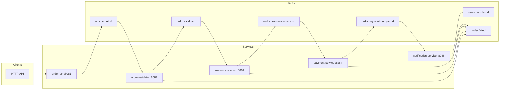
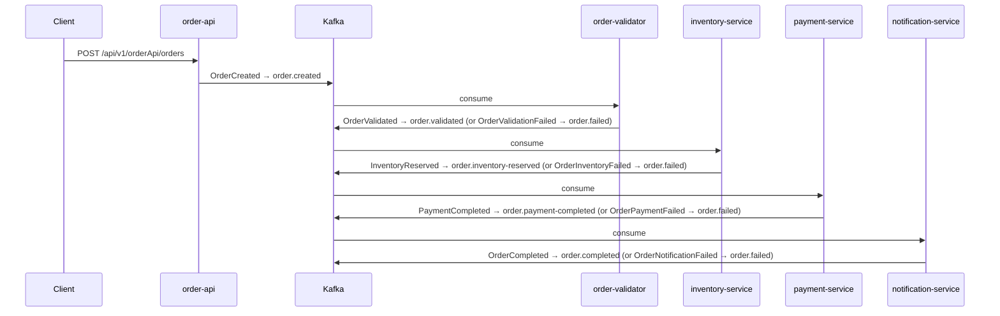

# Event-Driven Order Workflow

[](https://openjdk.org/)
[](https://spring.io/projects/spring-boot)
[](https://kafka.apache.org/)
[](https://gradle.org/)
[](https://www.docker.com/)
[](https://prometheus.io/)
[](https://grafana.com/)

This **project** demonstrating an event-driven order processing pipeline: from order creation through validation, inventory reservation, payment, and notification — all orchestrated via **Apache Kafka** and built with **Spring Boot 3** and **Java 21**.

---

## Features

- **Event-driven architecture** — services communicate only through Kafka topics; no direct HTTP calls between steps.
- **Failure handling** — any step can publish to `order.failed` with `eventType` and `failureReason` for DLQ/monitoring.
- **Observability** — Micrometer + Prometheus metrics on every service; Grafana for visualization.
- **Single-command run** — Kafka, all 5 microservices, Prometheus, and Grafana start with `docker compose up -d`.
- **Contract-first events** — shared envelope (`eventType`, `orderId`, `correlationId`, `timestamp`, `payload`) and documented in [docs/events.md](docs/events.md).
- **Idempotency-friendly** — events are keyed by `orderId` so consumers can safely reprocess.

---

## Architecture



---

## Event Flow (Sequence)



---

## Quick Start (Docker)

**Prerequisites:** Docker and Docker Compose.

```bash
git clone <repo-url>
cd "event-driven order"
docker compose up -d --build
```

This starts:

| Component           | Port  | Description                    |
|--------------------|-------|--------------------------------|
| **order-api**      | 8081  | REST API to create orders      |
| **order-validator**| 8082  | Validates orders               |
| **inventory-service** | 8083 | Reserves stock                 |
| **payment-service**   | 8084 | Processes payment             |
| **notification-service** | 8085 | Sends completion notification |
| **Kafka**          | 9092  | Event broker (KRaft mode)      |
| **Prometheus**     | 9090  | Metrics scraping               |
| **Grafana**        | 3000  | Dashboards (admin / admin)     |

Create an order:

```bash
curl -X POST http://localhost:8081/api/v1/orderApi/orders \
  -H "Content-Type: application/json" \
  -d '{"customerId":"cust-1","items":["ITEM-A","ITEM-B"],"totalAmount":9999}'
```

---

## API

### Create order

**`POST /api/v1/orderApi/orders`**

| Field         | Type     | Description        |
|---------------|----------|--------------------|
| `customerId`  | string   | Customer identifier |
| `items`       | string[] | Item IDs/SKUs      |
| `totalAmount` | number   | Order total (e.g. cents) |

**Example request:**

```json
{
  "customerId": "cust-1",
  "items": ["ITEM-A", "ITEM-B"],
  "totalAmount": 9999
}
```

The API publishes an **OrderCreated** event to `order.created` with a generated `orderId` and `correlationId`. The rest of the pipeline runs asynchronously.

---

## Project Structure

```
event-driven order/
├── order-events/          # Shared DTOs (OrderEventEnvelope)
├── order-api/             # REST API → order.created
├── order-validator/       # order.created → order.validated | order.failed
├── inventory-service/    # order.validated → order.inventory-reserved | order.failed
├── payment-service/       # order.inventory-reserved → order.payment-completed | order.failed
├── notification-service/  # order.payment-completed → order.completed | order.failed
├── docs/
│   └── events.md          # Event contracts, topics, payloads
├── grafana/               # Datasource provisioning (Prometheus)
├── docker-compose.yml     # Full stack: Kafka + 5 services + Prometheus + Grafana
├── Dockerfile             # Multi-service image (all 5 apps)
├── prometheus.yml         # Local Prometheus (host targets)
└── prometheus-docker.yml  # Prometheus config for Docker (service names)
```

---

## Running Locally (without Docker)

1. **Start Kafka** (e.g. local install or a single Kafka container on `localhost:9092`).
2. **Start Prometheus** (optional): `prometheus --config.file=prometheus.yml` — uses `localhost:8081–8085`.
3. **Run each service** (from repo root):

   ```bash
   ./gradlew :order-api:bootRun
   ./gradlew :order-validator:bootRun
   ./gradlew :inventory-service:bootRun
   ./gradlew :payment-service:bootRun
   ./gradlew :notification-service:bootRun
   ```

   Default ports are 8081–8085; Kafka is expected at `localhost:9092`.

---

## Testing

```bash
./gradlew test
```

Each service has unit tests (controllers and Kafka listeners) with mocked `KafkaTemplate` and `MeterRegistry`.

---

## Monitoring

- **Prometheus:** [http://localhost:9090](http://localhost:9090) — scrape targets: `order-api:8081` … `notification-service:8085` (when using Docker).
- **Grafana:** [http://localhost:3000](http://localhost:3000) — default login `admin` / `admin`; Prometheus is pre-provisioned as a datasource.

**Custom metrics** (examples):

- `orders_created_total`
- `orders_validated_total` / `orders_validation_failed_total`
- `orders_reserved_total` / `orders_inventory_failed_total`
- `orders_paid_total` / `orders_payment_failed_total`
- `orders_completed_total` / `orders_notification_failed_total`

Use **Explore** in Grafana and query these metric names.

---

## Event Contracts

Events, topics, and message formats are described in **[docs/events.md](docs/events.md)** (envelope shape, success/failure events, idempotency).

---

## License

[MIT](LICENSE) — see [LICENSE](LICENSE) for details.
